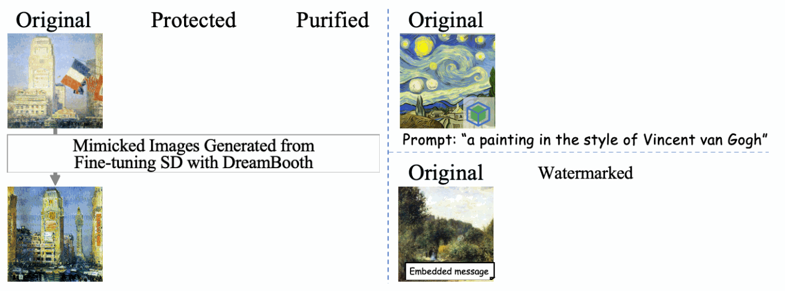

# CopyrightMeter: Revisiting Copyright Protection in Text-to-image Models

<div style="text-align: center;">
  <a href="https://arxiv.org/abs/2411.13144">
    
  </a>
</div>

<br>

<div style="text-align: center;">
  
</div>

---

## 📝 Introduction

Welcome to the official repository of the paper: [CopyrightMeter: Revisiting Copyright Protection in Text-to-image Models](https://arxiv.org/pdf/2411.13144)

**What is CopyrightMeter?**
- A **unified evaluation framework** for copyright protection in text-to-image diffusion models.
- **Core Capabilities**:
  - Evaluates **17 state-of-the-art protection methods** and **16 representative attacks**.
  - Uses **utility metrics** to assess **fidelity** (*quality retention*), **efficacy** (*protection effectiveness*), and **resilience** (*robustness against attacks*)  of protections under various attacks.
- **Purpose**:
  - Provides guidance for developing robust protection methods.
  - Establishes a **standard benchmark** for future research in text-to-image copyright protection.


<!---->


## 🌟 Overview


The code is organized as follows:
- `./protections/` contains code used for protections (Obfuscation Processing, Model Sanitization, and Digital Watermarking);
- `./attacks/` includes code used for attacks (Noise Purification, Concept Recovery, and Watermark Removal);
- `./evaluation/`  provides metrics for evaluating fidelity, efficacy, and resilience of copyright protection methods.

The table below provides a summary of the categories and their definitions within the CopyrightMeter framework:

| **Category**              | **Definition**                                                                                 |
|----------------------------------|-----------------------------------------------------------------------------------------------|
| **🔒 Protection:** Obfuscation Processing | Add adversarial perturbations on images to avoid image mimicry.                              |
| **⚔️ Attack:** Noise Purification         | Purify the protected images to nullify adversarial perturbations.                            |
| **🔒 Protection:** Model Sanitization     | Prevent DM from generating images containing specific concepts.                              |
| **⚔️ Attack:** Concept Recovery           | Retrieve the eliminated concept to recover the content generation.                          |
| **🔒 Protection:** Digital Watermarking   | Embed DM-based watermark into image generation.                                              |
| **⚔️ Attack:** Watermark Removal          | Tamper with images to remove watermark.                                                      |
  

## 🔍 Detailed Methods
CopyrightMeter integrates the code for copyright protection and attack methods in text-to-image diffusion models from the following projects.
We extend our heartfelt gratitude to the authors whose **groundbreaking work** and **shared code** have greatly enriched the field of copyright protection in text-to-image diffusion models.

### 🔒 Protection Schemes
The protection schemes include:
- Obfuscation Processing: [`./protections/obfuscation_processing`](./protections/obfuscation_processing)
- Model Sanitization: [`./protections/model_sanitization`](./protections/model_sanitization)
- Digital Watermarking: [`./protections/digital_watermarking`](./protections/digital_watermarking)

#### Obfuscation Processing
- [x] **AdvDM**: C. Liang, et al., *"Adversarial example does good: Preventing painting imitation from diffusion models via adversarial examples,"* in **ICML**, 2023. [[Paper]](https://arxiv.org/abs/2302.04578) [[Code]](https://github.com/psyker-team/mist)

- [x] **Mist**: C. Liang and X. Wu, *"Mist: Towards improved adversarial examples for diffusion models,"* arXiv preprint arXiv:2305.12683, 2023. [[Paper]](https://arxiv.org/abs/2305.12683) [[Code]](https://github.com/psyker-team/mist) [[Website]](https://psyker-team.github.io/index_en.html)

- [x] **Glaze**: S. Shan, et al., *"Glaze: Protecting artists from style mimicry by text-to-image models,"* in **USENIX Security**, 2023. [[Paper]](https://arxiv.org/abs/2302.04222) [[Code]](https://github.com/AAAAAAsuka/Impress/blob/main/glaze.py) [[Website]](https://glaze.cs.uchicago.edu/)

- [x] **PhotoGuard**: H. Salman, et al., *"Raising the cost of malicious AI-powered image editing,"* in **ICML**, 2023. [[Paper]](https://proceedings.mlr.press/v202/salman23a.html) [[Code]](https://github.com/MadryLab/photoguard)

- [x] **Anti-DreamBooth**: T. Van Le, et al., *"Anti-dreambooth: Protecting users from personalized text-to-image synthesis,"* in **ICCV**, 2023. [[Paper]](https://arxiv.org/abs/2303.15433) [[Code]](https://github.com/VinAIResearch/Anti-DreamBooth) [[Website]](https://vinairesearch.github.io/Anti-DreamBooth/)

#### Model Sanitization

- [x] **Forget-Me-Not**: G. Zhang, et al., *"Forget-me-not: Learning to forget in text-to-image diffusion models,"* in **CVPR**, 2024. [[Paper]](https://arxiv.org/abs/2303.17591) [[Code]](https://github.com/SHI-Labs/Forget-Me-Not)

- [x] **Erasing Concepts**: R. Gandikota, et al., *"Erasing concepts from diffusion models,"* in **ICCV**, 2023. [[Paper]](https://arxiv.org/abs/2303.07345) [[Code]](https://github.com/rohitgandikota/erasing) [[Website]](https://erasing.baulab.info/)

- [x] **Ablating Concepts**: N. Kumari, et al., *"Ablating concepts in text-to-image diffusion models,"* in **ICCV**, 2023. [[Paper]](https://arxiv.org/abs/2303.13516) [[Code]](https://github.com/nupurkmr9/concept-ablation) [[Website]](https://www.cs.cmu.edu/~concept-ablation/)

- [x] **Unified Concept Editing**: R. Gandikota, et al., *"Unified concept editing in diffusion models,"* in **WACV**, 2024. [[Paper]](https://arxiv.org/abs/2308.14761) [[Code]](https://github.com/rohitgandikota/unified-concept-editing) [[Website]](https://unified.baulab.info/)


- [x] **Negative Prompt**: AUTOMATIC1111, *"Negative prompt,"* 2022. [[Code]](https://github.com/CompVis/stable-diffusion/blob/main/scripts/txt2img.py) [[Website]](https://github.com/AUTOMATIC1111/stable-diffusion-webui)

- [x] **Safe Latent Diffusion**: P. Schramowski, et al., *"Safe latent diffusion: Mitigating inappropriate degeneration in diffusion models,"* in **CVPR**, 2023. [[Paper]](https://arxiv.org/abs/2211.05105) [[Code]](https://github.com/ml-research/safe-latent-diffusion) 


#### Digital Watermarking

- [x] **DiffusionShield**: Y. Cui, et al., *"DiffusionShield: A watermark for copyright protection against generative diffusion models,"* arXiv preprint arXiv:2306.04642, 2023. [[Paper]](https://arxiv.org/abs/2306.04642) [[Code]](https://github.com/Yingqiancui/DiffusionShield) 

- [x] **DIAGNOSIS**: Z. Wang, et al., *"DIAGNOSIS: Detecting unauthorized data usages in text-to-image diffusion models,"* in **ICLR**, 2024. [[Paper]](https://arxiv.org/abs/2307.03108) [[Code]](https://github.com/ZhentingWang/DIAGNOSIS) 

- [x] **Stable Signature**: P. Fernandez, et al., *"The stable signature: Rooting watermarks in latent diffusion models,"* in **ICCV**, 2023. [[Paper]](https://arxiv.org/abs/2303.15435) [[Code]](https://github.com/facebookresearch/stable_signature) [[Website]](https://pierrefdz.github.io/publications/stablesignature/)

- [x] **Tree-Rings Watermarks**: Y. Wen, et al., *"Tree-rings watermarks: Invisible fingerprints for diffusion images,"* in **NeurIPS**, 2023. [[Paper]](https://arxiv.org/abs/2305.20030) [[Code]](https://github.com/YuxinWenRick/tree-ring-watermark)

- [x] **ZoDiac**: L. Zhang, et al., *"Attack-resilient image watermarking using stable diffusion,"* in **NeurIPS**, 2024. [[Paper]](https://arxiv.org/abs/2401.04247) [[Code]](https://github.com/zhanglijun95/ZoDiac) 

- [x] **Gaussian Shading**: Z. Yang, et al., *"Gaussian shading: Provable performance-lossless image watermarking for diffusion models,"* in **CVPR**, 2024. [[Paper]](https://openaccess.thecvf.com/content/CVPR2024/papers/Yang_Gaussian_Shading_Provable_Performance-Lossless_Image_Watermarking_for_Diffusion_Models_CVPR_2024_paper.pdf) [[Code1]](https://github.com/bsmhmmlf/Gaussian-Shading) [[Code2]](https://github.com/lthero-big/A-watermark-for-Diffusion-Models) 

### ⚔️ Attack Schemes
The attack schemes include:
- Noise Purification: [`./attacks/noise_purification`](./attacks/noise_purification)
- Concept Recoveryn: [`./attacks/concept_recovery`](./attacks/concept_recovery)
- Watermark Removal: [`./attacks/watermark_removal`](./attacks/watermark_removal)
#### Noise Purification

- [x] **JPEG Compression**: G. K. Wallace, *"The JPEG Still Picture Compression Standard,"* in **Communications of the ACM**, 1991. [[Paper]](https://www.ijg.org/files/Wallace.JPEG.pdf)

- [x] **Quantization**: P. Heckbert, *"Color Image Quantization for Frame Buffer Display,"* in **ACM SIGGRAPH Computer Graphics**, 1982. [[Paper]](https://dl.acm.org/doi/pdf/10.1145/965145.801294)

- [x] **Total Variation Minimization**: A. Chambolle, *"An Algorithm for Total Variation Minimization and Applications,"* in **Journal of Mathematical Imaging and Vision**, 2004. [[Paper]](https://link.springer.com/article/10.1023/B:JMIV.0000011325.36760.1e)

- [x] **IMPRESS**: B. Cao, et al., *"IMPRESS: Evaluating the Resilience of Imperceptible Perturbations Against Unauthorized Data Usage in Diffusion-Based Generative AI,"* in **NeurlPS**, 2024. [[Paper]](https://arxiv.org/abs/2310.19248) [[Code]](https://github.com/AAAAAAsuka/Impress) 

- [x] **DiffPure**: W. Nie, et al., *"Diffusion Models for Adversarial Purification,"* in **ICML**, 2022. [[Paper]](https://arxiv.org/abs/2205.07460) [[Code]](https://github.com/NVlabs/DiffPure) [[Website]](https://diffpure.github.io/)


#### Concept Recovery

- [x] **LoRA**: E. J. Hu, et al., *"LoRA: Low-Rank Adaptation of Large Language Models,"* in **ICLR**, 2022. [[Paper]](https://arxiv.org/abs/2106.09685) [[Code]](https://huggingface.co/docs/diffusers/training/lora) 

- [x] **DreamBooth**: N. Ruiz, et al., *"DreamBooth: Fine Tuning Text-to-Image Diffusion Models for Subject-Driven Generation,"* in **CVPR**, 2023, pp. 22500–22510. [[Paper]](https://arxiv.org/abs/2208.12242) [[Code]](https://huggingface.co/docs/diffusers/training/dreambooth) [[Website]](https://dreambooth.github.io/)

- [x] **Textual Inversion**: R. Gal, et al., *"An Image is Worth One Word: Personalizing Text-to-Image Generation Using Textual Inversion,"* in **ICLR**, 2023. [[Paper]](https://arxiv.org/abs/2208.01618) [[Code]](https://huggingface.co/docs/diffusers/training/text_inversion) [[Website]](https://textual-inversion.github.io/)

- [x] **Concept Inversion**: M. Pham, et al., *"Circumventing Concept Erasure Methods for Text-to-Image Generative Models,"* in **ICLR**, 2023. [[Paper]](https://arxiv.org/abs/2308.01508) [[Code]](https://github.com/NYU-DICE-Lab/circumventing-concept-erasure) [[Website]](https://erasing.baulab.info/)

- [x] **Ring-A-Bell**: Y.-L. Tsai, et al., *"Ring-A-Bell! How Reliable Are Concept Removal Methods for Diffusion Models?"* in **ICLR**, 2024. [[Paper]](https://arxiv.org/abs/2310.10012) [[Code]](https://github.com/chiayi-hsu/Ring-A-Bell)


#### Watermark Removal

Watermark attacks are extended based on the **ZoDiac** framework, with code available at [wmattacker.py](https://github.com/zhanglijun95/ZoDiac/blob/master/main/wmattacker.py) and details in the paper [Attack-Resilient Image Watermarking Using Stable Diffusion](https://arxiv.org/pdf/2401.04247).

- [x] **Bright**

- [x] **Rotation**

- [x] **Crop**

- [x] **Blur**

- [x] **Learned Image Compression**: Z. Cheng, et al., *"Learned Image Compression with Discretized Gaussian Mixture Likelihoods and Attention Modules,"* in **CVPR**, 2020, pp. 7939–7948. [[Paper]](https://openaccess.thecvf.com/content_CVPR_2020/html/Cheng_Learned_Image_Compression_With_Discretized_Gaussian_Mixture_Likelihoods_and_Attention_CVPR_2020_paper.html) [[Code]](https://github.com/ZhengxueCheng/Learned-Image-Compression-with-GMM-and-Attention)

- [x] **DiffPure**: W. Nie, et al., *"Diffusion Models for Adversarial Purification,"* in **ICML**, 2022. [[Paper]](https://arxiv.org/abs/2205.07460) [[Code]](https://github.com/NVlabs/DiffPure) [[Website]](https://diffpure.github.io/)


## 📚 How to Cite
Thanks for your interest in our work. If you find our work useful for your research, please cite the following paper:
```
@article{xu2024copyrightmeter,
      title={CopyrightMeter: Revisiting Copyright Protection in Text-to-image Models}, 
      author={Naen Xu and Changjiang Li and Tianyu Du and Minxi Li and Wenjie Luo and Jiacheng Liang and Yuyuan Li and Xuhong Zhang and Meng Han and Jianwei Yin and Ting Wang},
      journal={arXiv preprint arXiv:2411.13144},
      year={2024}
}
```


## Acknowledgement
We thank the **ZJU TRAIL Lab** and the **Stony Brook University ALPS Lab** for their invaluable assistance in extending **CopyrightMeter**! 🎓✨